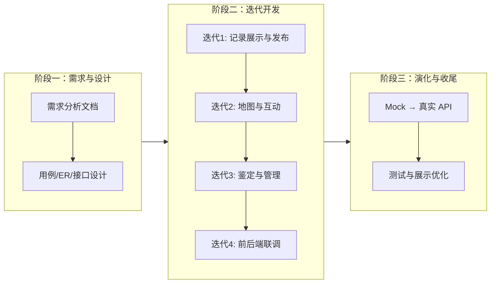

根据项目文档、代码结构与 Git 提交历史，整理如下软件过程模型说明，可直接用于课程报告或项目文档。

---

## 一、本项目采用的软件过程模型

本项目采用 **“需求分析先行 + 迭代增量开发 + 演化原型”** 的混合过程模型，可概括为：

> **以迭代增量开发为主干，前期辅以结构化需求分析，开发阶段借助演化原型降低前后端联调风险。**

它不是单一的瀑布模型或纯敏捷，而是针对课程项目约束（小团队、短周期、功能边界相对清晰）做出的务实组合。

---

## 二、各组成部分说明

### 1. 迭代增量开发（核心模型）

从 Git 提交历史可见明显的分阶段、逐功能交付路径：

| 阶段 | 主要交付内容 |
|------|-------------|
| 初期 | 项目初始化、基础框架搭建 |
| 第一轮迭代 | 观测记录展示、用户上传记录 |
| 第二轮迭代 | 地图定位、评论点赞、部分管理功能 |
| 第三轮迭代 | 地图能力完善、申诉与评论回复 |
| 第四轮迭代 | 前端核心功能基本完备 |
| 第五轮迭代 | 物种档案实现方式调整 |
| 第六轮迭代 | 前后端联调（注册/登录、全量 API 对接） |
| 收尾 | 展示优化与问题修复 |

这与需求文档中“**优先保证核心用例的完整实现**”的策略一致：先跑通“浏览—发布—展示”主链路，再逐步叠加地图、鉴定队列、管理后台等模块。

### 2. 演化原型法（辅助手段）

项目在 `services/local/` 目录实现了**本地 Mock 后端**，通过 `USE_LOCAL_BACKEND` 开关在前端与真实 API 之间切换：

```1:8:d:\miniprogram\miniprogram\miniprogram\services\api\config.ts
/** 后端 Base URL（与接口文档一致） */
export const API_BASE_URL = 'http://1.14.75.15'

/**
 * 后端模式开关
 * false = 使用云服务器 API；true = 使用本地 storage 模拟
 */
export const USE_LOCAL_BACKEND = false
```

这属于典型的**演化原型**思路：

- 前端不等待后端就绪，先用本地存储模拟用户、观测、鉴定等数据；
- 页面与交互可尽早验证；
- 后端 API 稳定后，再切换到 `services/api/remote/`，完成“原型 → 正式系统”的演化。

### 3. 结构化需求分析（前期阶段）

项目具备完整的《软件需求分析文档》（`需求说明文档.txt`），包含：

- 10 个用例（UC01–UC10）
- 三类角色（观测者、审阅员、管理员）
- 非功能需求（性能、安全、可用性）
- 10 个核心实体及 ER 关系

这一前期阶段类似瀑布模型中的**需求分析 + 概要设计**，为后续迭代提供了稳定边界，避免开发中频繁推翻架构。

---

## 三、选取该模型的原因（结合项目特点）

### 1. 团队规模小、工期紧

需求文档明确：**不超过 5 人、半个学期内完成**。

- 纯瀑布：文档重、变更成本高，难以应对地图 API 额度、微信登录等实际问题；
- 纯敏捷：缺少 Scrum Master、每日站会等配套，小团队易失控。

**迭代增量**更合适：每 1–2 周交付可演示的增量（如“能发观测”“能看地图”），便于课程答辩与进度把控。

### 2. 功能边界相对清晰，但交互细节需验证

平台六大模块（地图标记、物种档案、提交观测、求鉴定队列、个人日记、趣闻精选）在需求阶段已基本界定，适合**先写需求文档定方向**。

同时，移动端体验（地图聚合、发布流程、图鉴展示）难以在纸上完全确定，需要**快速原型 + 迭代反馈**来打磨，例如：

- 地图 SDK 免费额度有限 → 提交记录显示“退一步处理”；
- 定位权限被拒 → 改为预设校园地点选择（需求文档 UC03 备选流已预留）。

### 3. 前后端分离，联调风险高

前端为微信小程序，后端部署于云服务器（`http://1.14.75.15`），接口文档单独维护。

若采用“后端全部完成再联调”的瀑布式做法，前端会长期阻塞。本地 Mock 后端使前端可**并行开发**，联调阶段再统一切换，显著降低集成风险。

### 4. 多角色、多工作流，适合分模块增量交付

系统涉及三类角色、不同权限与页面：

- 观测者：首页、发布、个人中心
- 审阅员：待鉴定队列
- 管理员：用户管理、内容 moderation

按角色/模块分迭代交付，可先保证**观测者主流程**可用，再扩展审阅员与管理员能力，符合“核心用例优先”的约束。

### 5. 课程项目需可演示、可验收

迭代模型天然支持**阶段性演示**：每轮迭代结束都有可运行版本，满足“课程项目演示及验收期间核心功能须稳定可用”的非功能需求。

### 6. 技术栈与扩展性要求

需求文档要求模块化、可扩展（如预留 AI 识别、地图服务商替换）。项目采用：

- `services/api/` 统一 API 层 + local/remote 双实现
- 组件化（`observation-card`、`obs-filter-bar` 等）
- TypeScript 类型定义（`types/`）

这种架构与**增量演进**一致：新功能以新模块或新迭代加入，而不必一次性重构整个系统。

---

## 四、与其他模型的对比（为何不单独采用）

| 模型 | 不单独采用的原因 |
|------|------------------|
| **纯瀑布** | 需求虽清晰，但地图、微信登录、后端接口等外部依赖多，一次性交付风险大；小团队难以承受后期大规模返工。 |
| **纯原型法** | 需有明确验收标准与数据模型；仅做原型无法满足 10 个用例与 RBAC 等完整需求。 |
| **纯敏捷/Scrum** | 无专职 PO、固定 Sprint 规划；课程项目更偏“里程碑 + 迭代”而非完整 Scrum 仪式。 |
| **螺旋模型** | 偏重风险驱动的多轮原型与评审，对 5 人半学期项目偏重，成本过高。 |

---

## 五、过程模型示意



---

## 六、小结

本项目在软件过程上采用 **迭代增量开发为主、演化原型为辅、前期结构化需求分析打底** 的混合模型。选取依据可概括为：

1. **小团队、短周期** → 迭代交付、风险可控；  
2. **需求边界清晰、交互需验证** → 先文档后原型；  
3. **前后端分离** → Mock 后端支持并行开发；  
4. **多角色多模块** → 按优先级分增量实现；  
5. **课程验收导向** → 每轮迭代有可演示成果。

该组合在软件工程实践中常称为 **“轻量级迭代模型”** 或 **“增量式演化开发”**，适合类似校园众包平台这类功能明确、团队精简、周期有限的 Web/小程序项目。