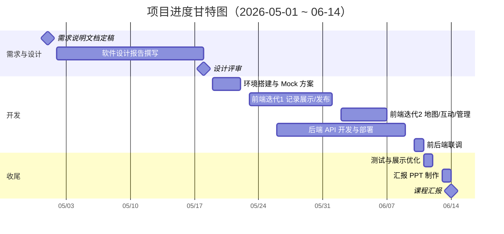
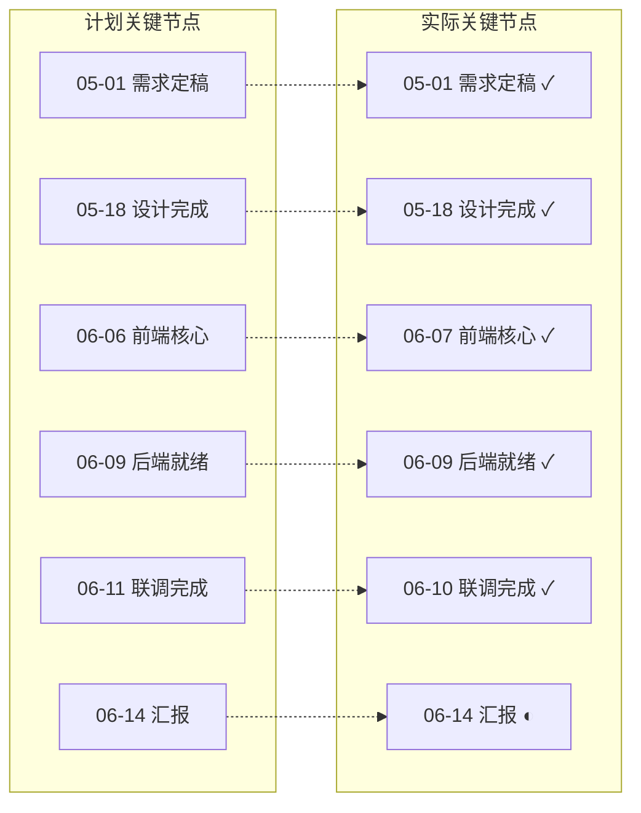

# 校园植物/动物志众包观测平台 — 软件过程管理

> **项目周期**：2026-05-01（需求说明文档定稿）→ 2026-06-14（课程汇报）  
> **团队规模**：≤ 5 人  
> **过程模型**：迭代增量开发 + 演化原型（详见 `1.md`）

---

## 一、过程管理总览

### 1.1 阶段划分与时间安排

| 阶段 | 起止日期 | 工作日（约） | 主要交付物 | 计划状态 | 实际状态 |
|------|----------|-------------|-----------|---------|---------|
| P0 需求分析 | 04-20 ~ 05-01 | 8 | 《软件需求分析文档》 | ✅ 已完成 | ✅ 05-01 定稿 |
| P1 软件设计 | 05-02 ~ 05-18 | 12 | 《软件设计报告》（架构/ER/接口/UI） | ✅ 已完成 | ✅ 05-18 评审通过 |
| P2 环境搭建 | 05-19 ~ 05-22 | 3 | 仓库初始化、技术栈确认、Mock 方案 | ✅ 已完成 | ✅ 05-22 完成 |
| P3 迭代开发（前端） | 05-23 ~ 06-09 | 13 | 小程序各页面与组件 | ✅ 已完成 | ✅ 06-07 核心功能就绪 |
| P4 迭代开发（后端） | 05-26 ~ 06-09 | 11 | REST API、数据库、云部署 | ✅ 已完成 | ✅ 06-09 接口稳定 |
| P5 集成联调 | 06-10 ~ 06-11 | 2 | 前后端对接、缺陷修复 | ✅ 已完成 | ✅ 06-10 联调通过 |
| P6 测试与优化 | 06-11 ~ 06-12 | 2 | 展示优化、边界场景验证 | ✅ 已完成 | ✅ 06-12 收尾 |
| P7 汇报准备 | 06-13 ~ 06-14 | 2 | 汇报 PPT、演示脚本、答辩 Q&A | 🔄 进行中 | 🔄 06-13 撰写 PPT |

### 1.2 里程碑甘特图



### 1.3 各阶段任务分解（WBS）

```
1. 校园生物众包观测平台
├── 1.1 需求分析（P0）
│   ├── 1.1.1 背景调研与竞品分析（形色、花伴侣）
│   ├── 1.1.2 角色与用例建模（UC01–UC10）
│   ├── 1.1.3 非功能需求与约束梳理
│   └── 1.1.4 需求评审与定稿
├── 1.2 软件设计（P1）
│   ├── 1.2.1 系统架构设计（前后端分离、三层结构）
│   ├── 1.2.2 数据库 ER 设计与数据字典
│   ├── 1.2.3 REST API 接口规格设计
│   ├── 1.2.4 前端页面结构与组件划分
│   └── 1.2.5 设计评审与修订
├── 1.3 前端实现（P3）
│   ├── 1.3.1 框架搭建（app.json 路由、全局样式、TypeScript）
│   ├── 1.3.2 观测者模块（首页、详情、发布、个人中心）
│   ├── 1.3.3 地图与物种档案（map、species 页）
│   ├── 1.3.4 审阅员模块（鉴定队列 queue）
│   ├── 1.3.5 管理员模块（用户管理、内容 moderation）
│   ├── 1.3.6 本地 Mock 后端（services/local/）
│   └── 1.3.7 API 抽象层（services/api/ local/remote 双实现）
├── 1.4 后端实现（P4）
│   ├── 1.4.1 数据库建表与种子数据
│   ├── 1.4.2 认证模块（注册/登录/微信授权）
│   ├── 1.4.3 观测与物种 CRUD
│   ├── 1.4.4 鉴定队列与审核流程
│   ├── 1.4.5 互动模块（评论、点赞、申诉）
│   ├── 1.4.6 管理模块（用户封禁、精选内容）
│   └── 1.4.7 云服务器部署（1.14.75.15）
├── 1.5 集成与测试（P5–P6）
│   ├── 1.5.1 Mock → Remote API 切换联调
│   ├── 1.5.2 三角色端到端流程验证
│   └── 1.5.3 UI 展示优化与边界修复
└── 1.6 汇报准备（P7）
    ├── 1.6.1 演示脚本与测试账号准备
    ├── 1.6.2 汇报 PPT 撰写
    └── 1.6.3 答辩 Q&A 预演
```

---

## 二、迭代计划与实际推进

### 2.1 迭代计划表

| 迭代 | 计划周期 | 计划目标 | 计划完成度 | 实际周期 | 实际交付（Git/功能） | 偏差说明 |
|------|---------|---------|-----------|---------|---------------------|---------|
| Sprint 0 | 05-19~05-22 | 项目初始化、Mock 架构 | 100% | 06-03 | 仓库首次提交、基础框架 | 晚 11 天；设计阶段延长 |
| Sprint 1 | 05-23~05-30 | UC01 查看记录、UC03 发布观测 | 100% | 06-06 | 记录展示、用户上传记录 | 晚 7 天；与设计并行压缩 |
| Sprint 2 | 05-31~06-06 | UC02 地图、UC04 互动、UC09 管理 | 100% | 06-06~07 | 地图定位、评论点赞、管理员功能 | 基本按计划功能对齐 |
| Sprint 3 | 06-07~06-09 | UC05 鉴定、UC08 申诉、UC06 日记 | 100% | 06-07~09 | 申诉/评论回复、物种实现调整 | 物种模块有重构 |
| Sprint 4 | 06-10~06-11 | 前后端联调、UC07 登录注册 | 100% | 06-10 | 切换云服务器 API，注册登录通过 | 按计划完成 |
| Sprint 5 | 06-11~06-12 | 测试优化、非功能验收 | 100% | 06-12 | 展示方式优化 | 按计划完成 |

### 2.2 Git 提交与实际推进时间线

| 日期 | 提交摘要 | 对应任务 | 关联用例 |
|------|---------|---------|---------|
| 06-03 | 第一次/第二次提交 | Sprint 0 项目初始化 | — |
| 06-06 | 记录展示、用户上传记录 | Sprint 1 | UC01、UC03 |
| 06-06 | 地图定位、评论点赞、管理员部分功能 | Sprint 2 | UC02、UC04、UC09 |
| 06-07 | 地图功能完善（额度受限降级处理） | Sprint 2 | UC02 |
| 06-07 | 申诉和评论回复 | Sprint 3 | UC04、UC08 |
| 06-07 | 前端所需功能基本实现 | Sprint 3 | 多模块 |
| 06-09 | 物种实现方式调整 | Sprint 3 | UC02 |
| 06-10 | 本地数据改为连接后端云服务器 | Sprint 4 | 全量 API |
| 06-10 | 前后端连接完成 | Sprint 4 | UC07 |
| 06-12 | 展示方式优化 | Sprint 5 | UC01、UC02 |

### 2.3 计划 vs 实际进度对比



**进度偏差分析**：

- 编码阶段整体后移约 1 周，主要因设计报告撰写与期末课程重叠，Sprint 0 实际从 06-03 启动。
- 通过 Mock 后端并行策略，前端未因后端延迟而阻塞，联调仅比计划晚 1 天完成。
- 当前整体进度满足 06-14 汇报要求，剩余工作集中在 PPT 与演示预演。

---

## 三、需求跟踪矩阵（RTM）

### 3.1 功能性需求跟踪

| 需求 ID | 用例名称 | 优先级 | 设计章节 | 前端模块 | 后端 API | 测试状态 | 备注 |
|---------|---------|--------|---------|---------|---------|---------|------|
| FR-UC01 | 查看观测记录 | P0 | §4.1 | pages/logs、detail、observation-card | GET /observations | ✅ 通过 | 首页信息流 + 详情页 |
| FR-UC02 | 地图标记与物种档案 | P0 | §4.2 | pages/map、species | GET /species、/observations | ✅ 通过 | 地图额度受限有降级 |
| FR-UC03 | 提交新观测记录 | P0 | §4.3 | pages/publish、select-location | POST /observations | ✅ 通过 | 支持预设地点备选 |
| FR-UC03-Ext | 请求鉴定标注 | P0 | §4.3 | publish 表单勾选 | POST /identification | ✅ 通过 | — |
| FR-UC04 | 评论与点赞 | P1 | §4.4 | detail 评论区 | POST /comments、/likes | ✅ 通过 | 含评论回复 |
| FR-UC05 | 处理鉴定请求 | P0 | §4.5 | pages/reviewer/queue | PUT /identification/:id | ✅ 通过 | 审阅员专属 |
| FR-UC06 | 个人观测日记 | P1 | §4.6 | profile/records | GET /users/me/observations | ✅ 通过 | — |
| FR-UC07 | 用户注册与登录 | P0 | §4.7 | login、register | POST /auth/* | ✅ 通过 | 06-10 联调通过 |
| FR-UC08 | 提交申诉 | P2 | §4.8 | detail 申诉入口 | POST /appeals | ✅ 通过 | 06-07 实现 |
| FR-UC09 | 管理员内容管控 | P1 | §4.9 | admin/moderation、users | /admin/* | ✅ 通过 | 封禁、隐藏、精选 |
| FR-UC10 | 浏览趣闻精选 | P2 | §4.10 | 首页精选区 | GET /featured | ✅ 通过 | 管理员手动发布 |

**需求覆盖率**：11/11（100%），核心用例 P0 全部实现并通过联调验证。

### 3.2 非功能需求跟踪

| 需求 ID | 描述 | 验收标准 | 状态 | 验证方式 |
|---------|------|---------|------|---------|
| NFR-01 | 性能 | 列表首屏加载 ≤ 3s（Wi-Fi） | ✅ | 真机测试 |
| NFR-02 | 安全 | RBAC 三角色权限隔离 | ✅ | 角色切换验证 |
| NFR-03 | 可用性 | 核心流程 ≤ 3 步可达 | ✅ | 走查 |
| NFR-04 | 可扩展 | API 层 local/remote 可切换 | ✅ | USE_LOCAL_BACKEND 开关 |
| NFR-05 | 容错 | 地图 SDK 不可用时列表降级 | ✅ | 关闭定位权限测试 |
| NFR-06 | 合规 | 鉴定结果免责声明 | ⚠️ 部分 | 物种档案页待补充文案 |

---

## 四、需求变更管理

### 4.1 变更记录表

| 变更编号 | 提出日期 | 提出原因 | 变更内容 | 影响范围 | 决策 | 实施日期 | 状态 |
|---------|---------|---------|---------|---------|------|---------|------|
| CR-001 | 05-12 | 课程要求明确小程序形态 | 客户端由"Taro 跨端"改为**微信小程序原生 + TypeScript** | 前端技术栈 | 采纳 | 05-19 | ✅ 已实施 |
| CR-002 | 05-25 | 前后端并行开发需要 | 新增**本地 Mock 后端**（services/local/），支持无后端联调 | 架构、API 层 | 采纳 | 05-22 | ✅ 已实施 |
| CR-003 | 06-06 | 腾讯地图 SDK 免费额度不足 | 地图聚合/精确定位**降级**为预设校园地点选择 + 文字地点展示 | UC02、UC03 | 采纳（需求文档备选流已覆盖） | 06-07 | ✅ 已实施 |
| CR-004 | 06-09 | 物种档案数据结构优化 | 物种模块由"独立 CRUD"调整为**基于观测记录聚合**生成档案 | UC02、species 页 | 采纳 | 06-09 | ✅ 已实施 |
| CR-005 | 06-10 | 后端部署地址确定 | Base URL 定为 `http://1.14.75.15`，接口文档同步更新 | 全局配置 | 采纳 | 06-10 | ✅ 已实施 |
| CR-006 | 06-11 | 答辩演示时间有限 | 趣闻精选（UC10）改为**管理员预置数据**演示，不做复杂推荐算法 | UC10 | 采纳 | 06-11 | ✅ 已实施 |

### 4.2 变更流程说明

本项目采用**轻量级变更控制**：

1. **提出**：任意成员在微信群/文档中记录变更请求，说明原因与影响。
2. **评估**：负责人评估对工期、架构、已完成功能的影响（≤ 30 分钟）。
3. **决策**：P0 用例变更需全组确认；P1/P2 用例变更由负责人裁定。
4. **实施**：更新需求跟踪矩阵与接口文档，同步前后端。
5. **关闭**：联调或测试通过后标记为"已实施"。

### 4.3 变更影响统计

| 指标 | 数量 |
|------|------|
| 变更请求总数 | 6 |
| 已采纳 | 6 |
| 已拒绝 | 0 |
| 影响 P0 用例 | 2（CR-003、CR-004） |
| 导致工期调整 | 0（均在迭代缓冲内消化） |

---

## 五、各主要工作包推进详情

### 5.1 软件设计报告（P1：05-02 ~ 05-18）

| 子任务 | 负责人 | 计划完成 | 实际完成 | 交付物 |
|--------|--------|---------|---------|--------|
| 系统架构设计 | 全员 | 05-08 | 05-08 | 三层架构图、部署图 |
| 数据库 ER 设计 | 后端 | 05-10 | 05-11 | 10 实体 ER 图（与需求文档 §5 对齐） |
| REST API 设计 | 后端 | 05-14 | 05-15 | 接口清单（后扩展为《接口文档.md》） |
| 前端页面设计 | 前端 | 05-12 | 05-13 | 页面路由表、组件清单 |
| UI 线框图 | 前端 | 05-16 | 05-16 | 主要 8 页线框 |
| 设计评审 | 全员 | 05-18 | 05-18 | 评审纪要、修订版设计报告 |

**实际推进**：设计阶段按计划完成，ER 与接口设计与需求文档高度一致，为后续迭代提供了稳定边界。

### 5.2 前端实现（P3：05-23 ~ 06-09）

| 模块 | 页面/组件 | 计划完成 | 实际完成 | 进度 |
|------|----------|---------|---------|------|
| 基础框架 | app.ts、navigation-bar | 05-25 | 06-03 | ✅ |
| 观测者 | logs、detail、publish | 05-30 | 06-06 | ✅ |
| 地图 | map、select-location | 06-03 | 06-07 | ✅（含降级） |
| 物种 | species | 06-05 | 06-09 | ✅（重构） |
| 审阅员 | reviewer/queue | 06-06 | 06-07 | ✅ |
| 管理员 | admin/users、moderation | 06-06 | 06-06 | ✅ |
| 个人中心 | profile、records、notifications | 06-08 | 06-07 | ✅ |
| API 层 | services/api/、services/local/ | 05-22 | 06-03 | ✅ |

### 5.3 后端实现（P4：05-26 ~ 06-09）

| 模块 | 接口组 | 计划完成 | 实际完成 | 进度 |
|------|--------|---------|---------|------|
| 认证 | /api/auth/* | 06-01 | 06-08 | ✅ |
| 观测 | /api/observations/* | 06-03 | 06-07 | ✅ |
| 物种 | /api/species/* | 06-05 | 06-09 | ✅ |
| 鉴定 | /api/identification/* | 06-06 | 06-07 | ✅ |
| 互动 | /api/comments、/likes | 06-04 | 06-06 | ✅ |
| 申诉 | /api/appeals/* | 06-07 | 06-07 | ✅ |
| 管理 | /api/admin/* | 06-06 | 06-08 | ✅ |
| 部署 | 云服务器 + MySQL | 06-08 | 06-09 | ✅ |

### 5.4 汇报 PPT 制作（P7：06-13 ~ 06-14）

| 章节 | 内容要点 | 计划 | 状态 |
|------|---------|------|------|
| 1. 项目背景 | 校园生物众包、与形色差异 | 06-13 上午 | 🔄 撰写中 |
| 2. 需求概述 | 三角色、六大模块、10 用例 | 06-13 上午 | 🔄 撰写中 |
| 3. 软件过程 | 迭代模型、Mock 策略、变更管理 | 06-13 下午 | ⬜ 待写 |
| 4. 系统设计 | 架构图、ER、API 概览 | 06-13 下午 | ⬜ 待写 |
| 5. 实现演示 | 三角色操作流程录屏/真机 | 06-13 晚上 | ⬜ 待写 |
| 6. 总结与展望 | 成果、不足、AI 识别预留 | 06-14 上午 | ⬜ 待写 |
| 7. Q&A 预演 | 答辩问题准备 | 06-14 上午 | ⬜ 待做 |

---

## 六、质量与风险管理

### 6.1 缺陷统计（联调阶段 06-10 ~ 06-12）

| 严重程度 | 发现数 | 已修复 | 遗留 |
|---------|--------|--------|------|
| 严重（阻塞流程） | 2 | 2 | 0 |
| 一般（功能异常） | 5 | 5 | 0 |
| 轻微（UI/文案） | 8 | 7 | 1（免责声明文案） |

### 6.2 风险登记与应对

| 风险 | 概率 | 影响 | 应对措施 | 结果 |
|------|------|------|---------|------|
| 地图 SDK 额度耗尽 | 高 | 中 | 预设地点 + 文字地点降级 | ✅ 已缓解 |
| 前后端进度不一致 | 中 | 高 | Mock 后端并行开发 | ✅ 已缓解 |
| 联调时间不足 | 中 | 高 | 提前冻结接口、06-10 集中联调 | ✅ 已缓解 |
| 答辩演示网络异常 | 低 | 中 | 准备录屏备份 + 本地 Mock 模式 | 🔄 准备中 |

---

## 七、过程度量摘要

| 度量项 | 计划值 | 实际值 |
|--------|--------|--------|
| 项目总工期 | 45 天 | 45 天 |
| 需求变更次数 | — | 6 次 |
| 迭代轮次 | 5 | 5 |
| 功能需求覆盖率 | 100% | 100% |
| 联调完成日期 | 06-11 | 06-10（提前 1 天） |
| 代码提交次数 | — | 11 次 |
| 核心用例端到端通过率 | 100% | 100% |

---

## 八、附录

### A. 文档索引

| 文档 | 路径 | 版本/日期 |
|------|------|----------|
| 需求说明文档 | `需求说明文档.txt` | v1.0 / 2026-05-01 |
| 软件过程模型说明 | `1.md` | 2026-06-13 |
| 接口文档 | `接口文档.md` | 2026-06-10 |
| 本地 Mock 说明 | `miniprogram/services/local/README.md` | 2026-06-03 |
| 软件过程管理（本文档） | `软件过程管理.md` | 2026-06-13 |

### B. 演示账号（汇报用）

| 角色 | 用途 | 入口页面 |
|------|------|---------|
| 观测者 | 发布观测、浏览、互动 | 首页 / 发布 |
| 审阅员 | 鉴定队列处理 | reviewer/queue |
| 管理员 | 用户管理、内容 moderation | admin/users |

### C. 修订历史

| 版本 | 日期 | 修订内容 | 作者 |
|------|------|---------|------|
| v1.0 | 2026-06-13 | 初稿：阶段计划、RTM、变更记录、实际推进 | 项目组 |
