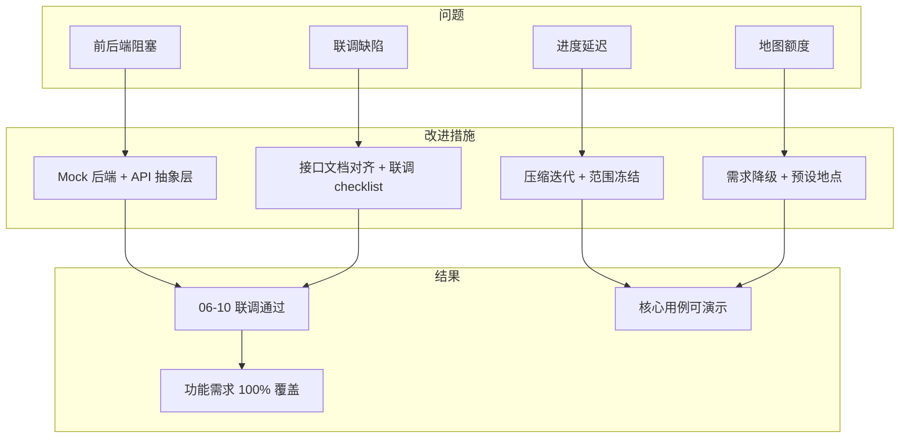

# 校园植物/动物志众包观测平台 — 过程问题与改进措施

> **文档目的**：总结项目推进过程中遇到的主要问题，记录已采取的调整与改进措施，并为后续迭代提供经验参考。  
> **关联文档**：`软件过程管理.md`、`1.md`、`需求说明文档.txt`

---

## 一、问题总览

项目整体按期完成需求定稿、设计、开发与联调，但在 **进度压缩、外部依赖、架构演进、协作沟通** 四类方面遇到了明显挑战。下表按问题编号汇总：

| 编号 | 问题类别 | 问题简述 | 发生阶段 | 严重程度 | 处理结果 |
|------|---------|---------|---------|---------|---------|
| P-01 | 进度管理 | 编码启动较计划延迟约 1 周 | P2 环境搭建 | 中 | ✅ 已通过并行开发与压缩迭代消化 |
| P-02 | 架构依赖 | 前后端进度不一致，前端存在联调阻塞风险 | P3/P4 开发 | 高 | ✅ 已通过 Mock 后端策略解决 |
| P-03 | 外部依赖 | 腾讯地图 SDK 免费额度不足 | P3 前端迭代 | 中 | ✅ 已降级为预设地点方案 |
| P-04 | 技术决策 | 前端技术栈由 Taro 改为微信原生 | P1 设计 | 低 | ✅ 已统一技术栈并完成实现 |
| P-05 | 设计演进 | 物种档案实现方式中途调整 | P3 前端迭代 | 中 | ✅ 已重构为观测聚合模式 |
| P-06 | 集成联调 | 接口字段/路径与实现存在偏差 | P5 联调 | 高 | ✅ 06-10 集中修复并通过 |
| P-07 | 平台约束 | 小程序 request 合法域名配置滞后 | P5 联调 | 中 | ✅ 已配置并完成真机验证 |
| P-08 | 过程管理 | 小团队缺少固定站会与书面任务跟踪 | 全周期 | 低 | ⚠️ 部分改善，仍有提升空间 |
| P-09 | 质量保障 | 联调前缺少系统化测试，缺陷集中暴露 | P5~P6 | 中 | ✅ 联调期集中修复，遗留 1 项轻微问题 |
| P-10 | 需求范围 | 非功能需求（免责声明文案）未及时落地 | P6 收尾 | 低 | ⚠️ 待补充 |

---

## 二、主要问题与改进措施（详述）

### 问题 P-01：编码阶段启动延迟

**问题描述**  
原计划 05-19 启动 Sprint 0（仓库初始化、Mock 架构），实际首次 Git 提交为 06-03，编码整体后移约 11 天。主因是软件设计报告撰写与期末课程、其他作业时间重叠，成员难以同步投入开发。

**影响**  
- 前端核心功能完成时间由 06-06 推迟至 06-07；  
- 各 Sprint 实际周期被压缩，后期开发强度明显上升；  
- 汇报 PPT 撰写窗口被挤压至最后 2 天。

**采取的调整与改进措施**

| 措施 | 具体做法 | 效果 |
|------|---------|------|
| 压缩迭代粒度 | 将原 5 个 Sprint 的目标合并为「按用例优先级分批交付」，先 UC01/UC03，再 UC02/UC04 | 06-06~07 连续交付 3 个 Sprint 目标 |
| 并行分工 | 设计评审通过后，前端立即搭建 Mock 环境，后端同步建表与接口骨架 | 减少「等设计完再动手」的空窗 |
| 冻结非核心需求 | UC10 趣闻精选改为管理员预置数据演示，不做推荐算法（CR-006） | 节省约 2 人日 |
| 里程碑复核 | 06-03 召开进度对齐，确认「06-10 必须联调、06-14 必须汇报」硬约束 | 全员优先级一致，避免 scope creep |

**经验总结**：课程项目中设计阶段不宜无限延长；设计评审通过即应启动可并行的编码任务（Mock、建表、页面骨架），即使主仓库尚未提交。

---

### 问题 P-02：前后端进度不一致，集成风险高

**问题描述**  
前端采用微信小程序，后端独立部署于云服务器。后端 API 在 06-08 前才逐步稳定，若前端等待真实接口，06-06 之前将无法验证页面与交互，集成窗口极窄。

**影响**  
- 前端开发长期依赖假数据或硬编码；  
- 联调阶段易出现「前端逻辑正确、接口对不上」的大规模返工；  
- 三角色权限流程难以端到端演练。

**采取的调整与改进措施**

| 措施 | 具体做法 | 效果 |
|------|---------|------|
| 引入演化原型（Mock 后端） | 在 `services/local/` 实现本地 storage 模拟，覆盖用户、观测、鉴定、评论等核心 API（CR-002） | 前端 06-03 起即可独立开发 |
| 统一 API 抽象层 | `services/api/` 提供 facade，通过 `USE_LOCAL_BACKEND` 开关切换 local/remote | 联调时仅改配置，业务代码零改动 |
| 接口契约先行 | 设计阶段输出 REST API 清单，联调前扩展为《接口文档.md》并双方签字确认 | 减少字段命名不一致 |
| 集中联调日 | 06-10 定为联调冻结日，当日完成 Mock → Remote 切换与注册/登录验证 | 06-10 当日联调通过 |

**关键代码策略**（配置层一键切换）：

```typescript
// services/api/config.ts
export const USE_LOCAL_BACKEND = false  // 联调后切换为 false
export const API_BASE_URL = 'http://1.14.75.15'
```

**经验总结**：前后端分离项目中，**Mock 层不是临时补丁，而是过程改进的核心手段**；应在设计阶段就纳入架构，而非后端延期后的补救。

---

### 问题 P-03：腾讯地图 SDK 免费额度不足

**问题描述**  
06-06 集成地图功能时发现腾讯地图 SDK 免费调用额度有限，精确定位、标记聚合等功能在开发/演示环境下频繁触发限额，地图页出现加载失败或标记无法展示。

**影响**  
- UC02「地图标记与物种档案」无法按设计稿完整演示；  
- UC03 发布流程中「地图选点」体验不稳定；  
- 若强行实现完整聚合，答辩演示存在现场失败风险。

**采取的调整与改进措施**

| 措施 | 具体做法 | 效果 |
|------|---------|------|
| 需求降级（CR-003） | 启用需求文档 UC03 备选流：改为**预设校园地点选择**（二食堂东门、图书馆北侧等） | 发布流程稳定可用 |
| 地图展示降级 | 缩小聚合粒度，额度不足时回退为文字地点 + 列表入口 | 06-07 提交「退一步处理」 |
| 种子数据预置 | 在 `data/locations.ts` 预设 5 个校园地标作为初始标记点 | 避免「空地图」影响演示 |
| 非功能需求对齐 | 落实 NFR-05「地图 SDK 不可用时列表降级」 | 关闭定位权限仍可浏览记录 |

**经验总结**：涉及第三方 SaaS/SDK 的功能，应在设计阶段评估**免费额度与演示用量**，并提前在需求文档中写好备选流，避免开发后期被动砍功能。

---

### 问题 P-04：前端技术栈中途调整

**问题描述**  
需求文档初稿写「微信小程序或 Taro 跨端均可」，05-12 课程要求明确为微信小程序形态后，团队需在一周内确定是否沿用 Taro。

**影响**  
- 若切换决策过晚，已有学习笔记与示例代码作废；  
- 设计报告中的前端框架描述需同步修订。

**采取的调整与改进措施**

| 措施 | 具体做法 | 效果 |
|------|---------|------|
| 快速决策（CR-001） | 05-19 前确定采用**微信原生 + TypeScript**，放弃 Taro | 05-22 前统一开发环境 |
| 更新设计文档 | 设计报告前端章节同步修订为 WXML/WXSS/TS 结构 | 避免文档与代码不一致 |
| 组件化约定 | 抽取 `observation-card`、`obs-filter-bar` 等可复用组件 | 降低原生开发重复劳动 |

**经验总结**：技术栈应在 **Sprint 0 之前冻结**；「可选方案」在需求文档中应尽早收敛为单一决策。

---

### 问题 P-05：物种档案模块中途重构

**问题描述**  
初版设计将物种档案作为独立 CRUD 实体维护；开发过程中发现与「众包观测聚合」的业务模型不一致——物种信息应随观测记录自然累积，而非管理员预先录入。

**影响**  
- 06-05~09 物种相关前后端代码需重写；  
- 接口文档中 `/api/species` 语义需调整；  
- 约 1 人日额外重构成本。

**采取的调整与改进措施**

| 措施 | 具体做法 | 效果 |
|------|---------|------|
| 架构调整（CR-004） | 物种档案改为**基于 Observation 聚合生成**（照片墙、常出现地点由观测记录统计） | 更贴合众包业务模型 |
| 增量迁移 | 保留 Species 实体作索引，观测记录关联 species_id | 后端改动可控 |
| 变更登记 | 在需求变更表 CR-004 记录原因与影响范围 | 可追溯、可写入答辩说明 |

**经验总结**：众包类系统的「档案/统计」类模块，设计阶段应优先论证**数据来源是聚合还是独立维护**，避免实现与业务模型冲突。

---

### 问题 P-06：联调阶段接口不一致

**问题描述**  
06-10 切换至真实 API 后，发现部分接口存在字段命名差异（如 camelCase vs snake_case）、图片路径需拼接 Base URL、个别枚举值与 Mock 层不一致等问题，当日出现 2 个严重阻塞缺陷。

**影响**  
- 注册/登录首次联调失败；  
- 观测列表图片无法显示；  
- 若不能当日修复，将挤占测试与 PPT 时间。

**采取的调整与改进措施**

| 措施 | 具体做法 | 效果 |
|------|---------|------|
| 接口文档对齐（CR-005） | 以《接口文档.md》为唯一真相源，Mock 与 Remote 双实现对齐 | 06-10 下午修复阻塞问题 |
| 类型定义统一 | 在 `services/api/remote/types.ts` 集中定义 DTO，前端页面只消费转换后模型 | 减少字段散落硬编码 |
| 图片 URL 规范 | 约定相对路径 + Base URL 拼接规则，文档中给出默认头像/默认照片 fallback | 图片展示问题一次性解决 |
| 联调 checklist | 按 UC07 → UC01 → UC03 → UC05 顺序验证三角色主路径 | 2 个严重缺陷当日关闭 |

**经验总结**：Mock 层必须与 Remote 层**共用同一份接口文档与类型定义**，而不是各写各的；联调前应跑通 checklist，而非「全量切换后再测」。

---

### 问题 P-07：微信小程序合法域名与真机调试

**问题描述**  
开发阶段在开发者工具中勾选「不校验合法域名」可正常请求 `http://1.14.75.15`；真机预览时未配置 request 合法域名导致请求失败，影响 06-10 联调验证。

**影响**  
- 真机无法完成注册/登录演示；  
- 答辩若用真机展示，存在现场风险。

**采取的调整与改进措施**

| 措施 | 具体做法 | 效果 |
|------|---------|------|
| 后台配置域名 | 在微信公众平台配置 request 合法域名为后端地址 | 真机请求正常 |
| 开发/生产分离说明 | 在 `services/local/README.md` 注明开发阶段可临时关闭校验 | 新成员 onboarding 清晰 |
| 演示双保险 | 准备开发者工具演示 + 真机演示 + 录屏备份 | 降低答辩现场风险（见 P-09 风险应对） |

---

### 问题 P-08：小团队过程规范不足

**问题描述**  
团队 ≤ 5 人，未设立专职 Scrum Master，缺少固定每日站会、燃尽图、任务看板等正式仪式；任务分工主要依赖微信群口头同步，偶发「以为对方在做、实际未开始」的情况。

**影响**  
- Sprint 0 延迟部分与沟通不同步有关；  
- 接口变更未及时通知前端，加剧 P-06；  
- 过程度量数据（工时、完成率）不够精确。

**采取的调整与改进措施**

| 措施 | 具体做法 | 效果 |
|------|---------|------|
| 轻量级变更流程 | 建立 CR-001~006 变更登记，微信群 + 文档双轨记录 | 6 次变更均可追溯 |
| 里程碑对齐会 | 06-03、06-10 两次关键节点全员同步 | 避免后期互相阻塞 |
| 文档驱动协作 | 接口文档、过程管理文档、Git 提交信息承担部分「站会纪要」功能 | 弥补无 daily standup 的不足 |
| Git 提交规范 | 提交信息注明功能模块（如「地图定位」「前后端连接」） | 可还原实际推进时间线 |

**尚待改进**（后续项目建议）  
- 引入简易看板（如 GitHub Projects / 飞书多维表格）；  
- 固定每周 2 次 15 分钟 sync；  
- 接口变更必须同步更新文档并 @ 相关成员。

---

### 问题 P-09：测试滞后，缺陷集中爆发

**问题描述**  
开发阶段以「功能可演示」为主，缺少单元测试与系统化集成测试；06-10~12 联调与测试阶段共发现 15 个缺陷（2 严重、5 一般、8 轻微），修复工作集中在这 3 天内。

**影响**  
- 联调首日压力较大；  
- 部分 UI 细节（间距、空状态文案）在 06-12 才修复；  
- 测试时间被压缩，回归测试不充分。

**采取的调整与改进措施**

| 措施 | 具体做法 | 效果 |
|------|---------|------|
| 按用例优先级测试 | 先测 P0 用例端到端，再测 P1/P2 | 核心流程 100% 通过 |
| 三角色场景脚本 | 编写观测者发布 → 审阅员鉴定 → 管理员 moderation 演示脚本 | 答辩可复现 |
| 缺陷分级处理 | 严重/一般必须当日关闭，轻微可延至 06-12 | 2 严重 + 5 一般全部修复 |
| 展示层优化 commit | 06-12「优化了一些展示方式」针对 UI 轻微问题集中收尾 | 演示体验改善 |

**经验总结**：即使工期紧，也应在**每个 Sprint 结束**做最小范围冒烟测试，而非全部留到联调日。

---

### 问题 P-10：非功能需求落地不及时

**问题描述**  
需求文档要求物种档案页展示「鉴定结果免责声明」，开发聚焦功能实现，该文案至 06-12 仍未补充，NFR-06 标记为「部分完成」。

**影响**  
- 合规性展示不完整；  
- 答辩可能被问及而答不充分。

**计划改进措施**

| 措施 | 计划时间 | 状态 |
|------|---------|------|
| 在 species 页底部增加免责声明静态文案 | 06-13 | ⬜ 待实施 |
| 在汇报 PPT「不足与展望」中说明 | 06-14 | ⬜ 待实施 |

---

## 三、改进措施成效汇总



| 改进策略 | 针对问题 | 量化效果 |
|---------|---------|---------|
| Mock 后端 + 双实现 API 层 | P-02、P-06 | 前端提前 7+ 天独立开发；联调 1 天完成 |
| 需求降级与备选流 | P-03 | UC02/UC03 稳定可演示，无现场地图失败 |
| 物种聚合重构 | P-05 | 业务模型一致，避免「空档案」逻辑漏洞 |
| 集中联调 + checklist | P-06、P-09 | 15 个缺陷 3 日内关闭 14 个 |
| 范围冻结（UC10 简化） | P-01 | 节省 2 人日，保障汇报节点 |
| 轻量级变更管理 | P-04、P-05、P-08 | 6 次变更均有记录、零失控扩 scope |

---

## 四、过程改进前后对比

| 维度 | 改进前（问题状态） | 改进后（当前状态） |
|------|------------------|------------------|
| 前后端协作 | 前端等后端，集成窗口 < 2 天 | Mock 并行，联调 1 天通过 |
| 地图功能 | 强依赖 SDK 额度，演示不稳定 | 预设地点 + 降级方案，演示稳定 |
| 物种模块 | 独立 CRUD，与众包模型不符 | 观测聚合，数据自然增长 |
| 接口一致性 | Mock 与 Remote 各自实现 | 以接口文档为准双实现对齐 |
| 变更管理 | 口头沟通，易遗漏 | CR 编号登记，6 次变更可追溯 |
| 进度 visibility | 无看板，依赖 Git 事后还原 | 过程管理文档 + 里程碑对齐会 |
| 测试 | 联调前几乎无系统测试 | 三角色脚本 + 分级缺陷处理 |

---

## 五、经验教训与后续建议

### 5.1 做得好的方面

1. **Mock 后端策略**：是本项目最成功的过程改进，值得作为前后端分离课程项目的标准做法。  
2. **需求文档备选流**：UC03 预设地点方案在地图出问题时可直接启用，说明前期需求分析有价值。  
3. **迭代优先级**：先主链路（浏览—发布—展示），再地图/鉴定/管理，保证任何时间点都有可演示版本。  
4. **接口文档独立维护**：联调问题的最终裁决依据清晰，减少扯皮。

### 5.2 仍需加强的方面

| 方面 | 现状 | 建议 |
|------|------|------|
| 进度预警 | 编码延迟 11 天才在文档中体现 | 设 weekly checkpoint，偏差 > 3 天即调整 scope |
| 测试左移 | 缺陷集中在联调期 | 每 Sprint 结束做 P0 冒烟测试 |
| 过程仪式 | 无固定站会 | 每周 2 次 15 min sync + 简易看板 |
| 非功能需求 | 免责声明等待补 | 与设计报告同步列入 DoD（Definition of Done） |
| 第三方依赖 | 地图额度事后才发现 | 设计阶段做 PoC 验证额度与真机表现 |

### 5.3 若重新开始，我们会这样做

1. **05-18 设计评审当天**即创建仓库、提交骨架代码，不等到 06-03。  
2. **05-22 前**完成 Mock 层与接口文档 v1.0，前后端对同一契约开发。  
3. **05-25 前**对地图 SDK 做 1 天 PoC，确认额度与降级方案。  
4. **每个 Sprint 末**跑 P0 用例冒烟 + 更新 RTM 状态。  
5. **06-08 前**完成一次 Mock/Remote 切换预演，而非 06-10 才首次切换。

---

## 六、附录

### A. 问题—措施—变更对照表

| 问题编号 | 关联变更编号 | 关键改进措施 |
|---------|-------------|-------------|
| P-01 | CR-006 | 冻结非核心需求、压缩迭代 |
| P-02 | CR-002 | Mock 后端 + API 抽象层 |
| P-03 | CR-003 | 地图降级 + 预设地点 |
| P-04 | CR-001 | 技术栈冻结为微信原生 + TS |
| P-05 | CR-004 | 物种档案聚合重构 |
| P-06 | CR-005 | 接口文档对齐 + 联调 checklist |
| P-07 | — | 微信合法域名配置 + 演示备份 |
| P-08 | — | 轻量级变更流程 + 里程碑对齐会 |
| P-09 | — | 三角色测试脚本 + 缺陷分级 |
| P-10 | — | 待补充免责声明文案 |

### B. 修订历史

| 版本 | 日期 | 修订内容 |
|------|------|---------|
| v1.0 | 2026-06-13 | 初稿：10 项过程问题与改进措施总结 |
